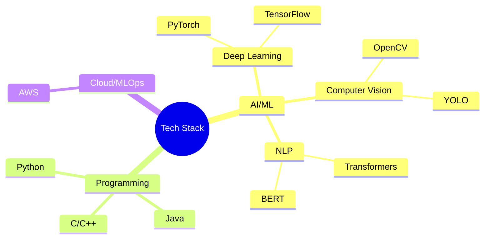
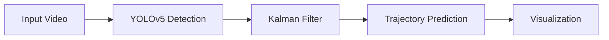
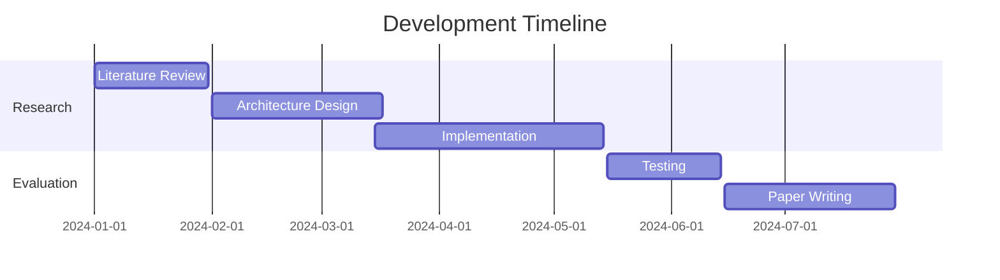
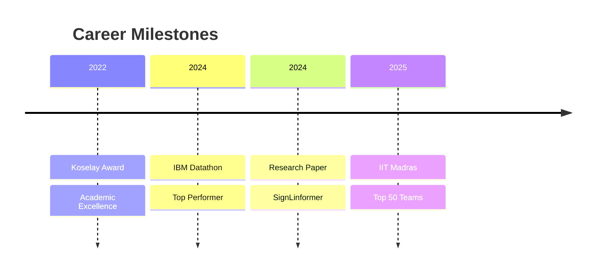

  
# 🚀 Ragunath R 
### Aspiring AI Engineer

  
  
 

  

## 🎯 About Me
Passionate AI Engineer specializing in Natural language processing and computer vision, with a strong focus on developing innovative solutions for real-world problems. Currently pursuing B.Tech in AI & ML at Saveetha Engineering College.

## 💻 Technical Stack

## 🚀 Featured Projects

### 1. Space Debris Tracking System
*An advanced computer vision system for tracking space debris*

- 📊 96.5% Detection Accuracy
- 🎯 94.2% Tracking Precision
- ⚡ 30 FPS Real-time Processing
- 🔍 10px Minimum Object Detection Size

### 2. SignLinformer: Text to Gesture Translation
*Novel transformer architecture for sign language translation*

## 📊 Skills Matrix

<table>
  <tr>
    <th>Category</th>
    <th>Skills</th>
    <th>Proficiency</th>
  </tr>
  <tr>
    <td>Languages</td>
    <td>
      
      
      
    </td>
    <td>
      

        

      

    </td>
  </tr>
  <tr>
    <td>AI/ML</td>
    <td>
      
      
      
    </td>
    <td>
      

        

      

    </td>
  </tr>
</table>

## 📈 GitHub Stats

  
  

## 🏆 Achievements

## 🎓 Education

- **B.Tech in AI & ML** (2022-2026)
  - Saveetha Engineering College
  - GPA: 8.00/10.00

### Certifications
- 🏅 Machine Translation (Coursera, 2025)
- 🏅 Computer Vision (Coursera, 2025)

## 🤝 Let's Connect!

  
  
  

---

  
  
  

