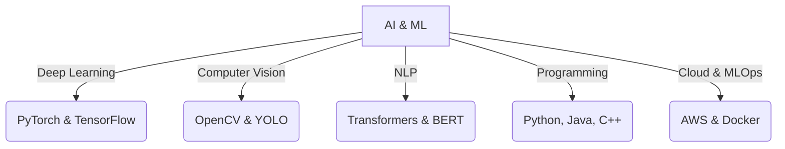
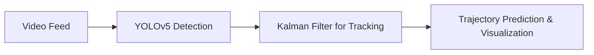
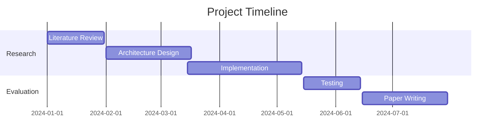

## 🚀 Ganesh R | AI & ML Enthusiast

### 📧 Connect with Me

## 🎯 About Me

Innovative AI Engineer with a passion for solving complex real-world problems through AI & ML. Pursuing B.Tech in AI & ML at Saveetha Engineering College.

## 🛠️ Technical Skills

## 🚀 Featured Projects

### **Space Debris Tracking System**
*Advanced AI for tracking space debris.*

- 📊 96.5% Detection Accuracy  
- 🎯 94.2% Tracking Precision  
- ⚡ 30 FPS Real-time Processing  

### **SignLinformer: Text to Gesture Translation**
*Innovative transformer-based model for sign language translation.*

## 📈 GitHub Stats

  
  

## 🏆 Achievements

## 🎓 Education

- **B.Tech in AI & ML** (2022-2026)  
  - Saveetha Engineering College  
  - GPA: 8.00/10.00  

### 📜 Certifications
- 🏅 Machine Translation (Coursera, 2025)  
- 🏅 Computer Vision (Coursera, 2025)  

## 🤝 Let's Connect!

  
  
  

---

  

